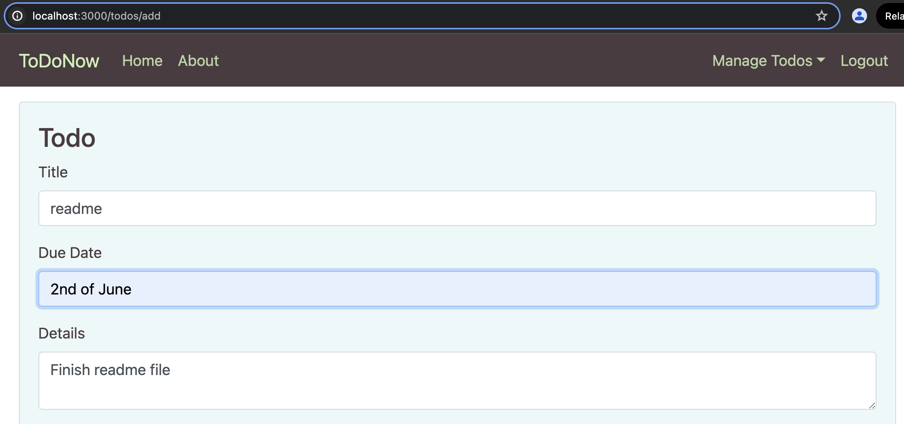
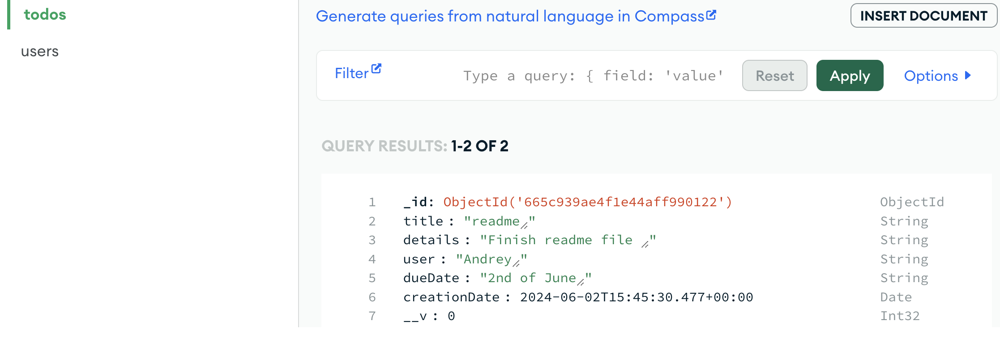
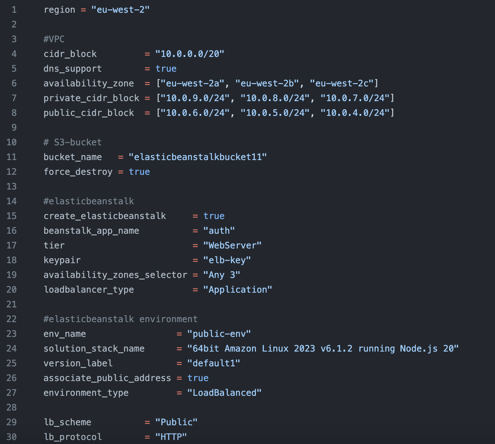

## Todo App with AWS Elastic Beanstalk ☁️

This project is a simple Todo app where users can register with their email addresses, create, edit, and delete Todo items. The application is deployed using AWS Elastic Beanstalk and utilizes various AWS services such as Amazon S3 for storing application files, MongoDB for the database, and a standard VPC setup with public and private subnets along with a NAT gateway.


Description: A screenshot of the Todo app's interface displaying a newly created Todo item with its title, details, due date, and creation date.


Description: A screenshot of the MongoDB database showing the newly created Todo item stored with its respective fields.


## Technologies Used
<p>
  
  
  
</p>

- **AWS**: Provides the cloud infrastructure and services needed to host and run the application, including Elastic Beanstalk for application deployment and management, S3 for storage, and other supporting services.
- **Terraform**: Builds and manages the infrastructure on AWS where the application is deployed.
- **MongoDB**: Serves as the database for the application.

## AWS resources used 
<p>
  
  
  
  
</p>

- **AWS Elastic Beanstalk**: AWS Elastic Beanstalk is a platform-as-a-service (PaaS) that simplifies the deployment, management, and scaling of web applications and services. It automatically handles the infrastructure provisioning, load balancing, scaling, and monitoring of applications.
- **Amazon S3**: Amazon Simple Storage Service (S3) is a scalable object storage service used to store and retrieve large amounts of data, such as application zip files. It is designed for durability, availability, and security, making it ideal for backup and archiving.
- **VPC (Virtual Private Cloud)**: Amazon Virtual Private Cloud (VPC) lets you provision a logically isolated section of the AWS Cloud where you can launch AWS resources in a virtual network that you define. It provides control over your virtual networking environment, including selection of your IP address range, creation of subnets, and configuration of route tables and network gateways.
- **IAM (Identity and Access Management)**: AWS Identity and Access Management (IAM) enables you to securely control access to AWS services and resources for your users. It provides features for managing users, groups, roles, and their associated permissions.


## Getting Started 🚀


Before deploying the app, ensure you have the following installed:

- [Terraform](https://www.terraform.io/downloads.html) 
- [Node.js](https://nodejs.org/en/download/) 
- [MongoDB](https://www.mongodb.com/try/download/community)
- [AWS CLI](https://aws.amazon.com/cli/) 

## Setup Instructions

1. **Clone the repository**

    ```sh
    git clone https://github.com/Andriizachepilo/Elasticbeanstalk-WebServer
    ```

2. **Create a `.env` file**

    Navigate to the `app/` directory and create a `.env` file based on the `.env.example` file. Update the MongoDB URL as required.

    ```sh
    cd app
    cp .env.example .env
    ```

    **Example `.env` file:**

    ```env
    DB=mongodb://your-mongodb-url:port/dbname
    ```

3. **Check Terraform variables**

Review the `terraform.tfvars` file settings. Below is an example configuration:




4. ## Create a Key Pair for Elastic Beanstalk 🔑

You need a key pair to access the instances created by Elastic Beanstalk. 

5. **Create IAM User and Service Role**

    An IAM user and service role will be created to allow Elastic Beanstalk to use EC2 instances, S3 bucket, and other resources.

6. **Run the deployment script**

    Run the `test-and-deploy` script to check the MongoDB connection, package the application, and deploy it using Terraform.

    ```sh
    ./test-and-deploy
    ```

## Project Architecture 🏗️

- **Elastic Beanstalk**: Deploys the application along with Load Balancer, Autoscaling Group, and optionally CloudFormation stack for resource management.
- **Amazon S3**: Stores zip files containing application code.
- **MongoDB**: Database for storing Todo items.
- **VPC**: Configured with public and private subnets along with a NAT gateway.
- **CloudWatch**: Monitors CPU utilization and other metrics.

## Additional Resources

- [Terraform Documentation](https://www.terraform.io/docs)
- [Node.js Documentation](https://nodejs.org/en/docs/)
- [MongoDB Documentation](https://docs.mongodb.com/)
- [AWS CLI Documentation](https://aws.amazon.com/documentation/cli/)
